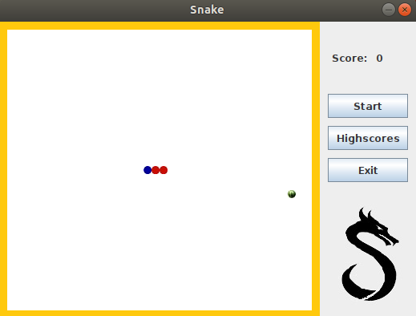
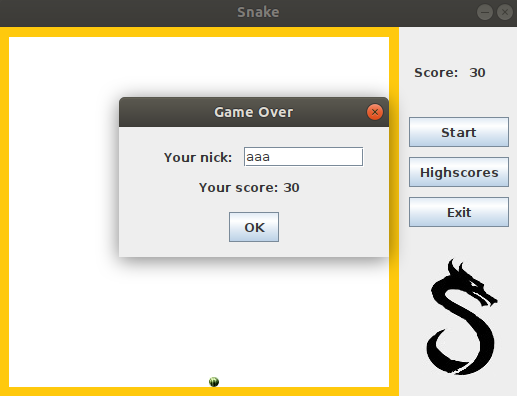
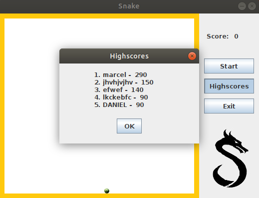

# Snake
Game made using Swing and AWT in MVC pattern

## Table of contents
* [General info](#general-info)
* [Screenshots](#screenshots)
* [Technologies](#technologies)
* [Features](#features)
* [Status](#status)

## General info
Game made as a project for the subject Event-driven Programming on the Warsaw University of Technology and to get familiar with Java, MVC software design pattern, Swing and AWT

## Screenshots

## Technologies
* Java - version 13.0.1
* Swing
* AWT

## Features
This is a typical Snake game in which the user can:
- start the game clicking on the "Start" button
- control the snake using arrow keys
- gain points after eating watermelons
- save his score with his own nick 
- display the highscores clicking on the "Highscores" button
- end the game whenever he wants

## Status
This project is almost finished but the structure of MVC should be changed. Listeners should be located in Controller and the program should set action commands in View.
